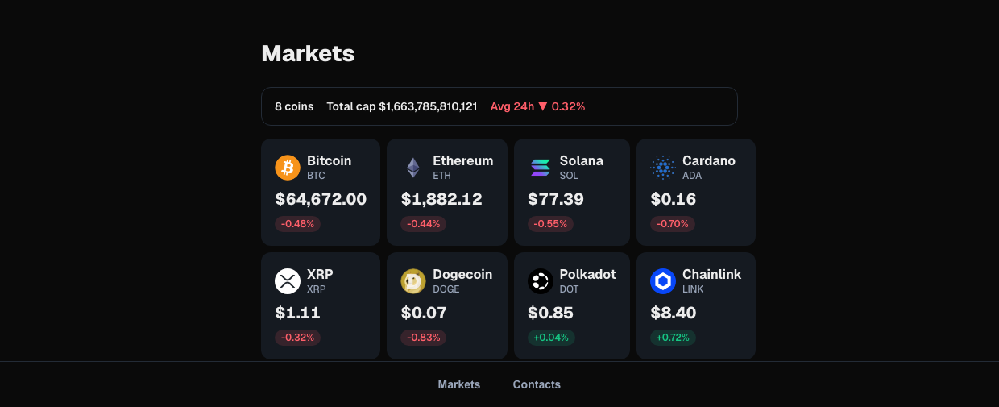

# Kraken Price Watcher

Live cryptocurrency prices, streamed from Kraken's WebSocket feed and rendered on a server-first Next.js stack.

**[View the live demo →](https://kraken-price-watcher-web.vercel.app/)** · [React Native sibling →](https://github.com/MReintop/kraken-price-watcher)

[](https://github.com/MReintop/kraken-price-watcher-web/actions/workflows/ci.yml)



- **One socket, coalesced** — a single Kraken connection for every symbol, buffered into at most one Redux dispatch per 250ms, latest tick per symbol winning.
- **RSC-first, and it can't regress** — prices are in the HTML on first paint, and an e2e test asserts the markets page makes **zero** client HTTP requests for them. (The socket is the exception it exists for: it keeps the prices live, it does not fetch them.)
- **Accessibility is driven, not just scanned** — WCAG 2.1 AA across every route, including states you have to interact to reach: the error state, a timeframe switch, client-side navigation.
- **Byte budgets, not timings** — each route budgets its JS and total transfer a few percent above the current build, because bytes are deterministic and wall-clock isn't.
- **Hermetic CI** — the e2e suite redirects both REST upstreams _and_ the socket to a stub at build time, so the bundle under test cannot reach the exchange and an outage can't turn the pipeline red.

## What it does

A markets page lists eight tracked coins with their price and 24-hour change; each coin has a detail page with a candlestick chart over a selectable timeframe. Prices tick live — one WebSocket connection, shared across every row on the page.

## How it's built

**Prices come from exactly one source.** Coin identity (name, icon, market cap) comes from CoinGecko; every _price_ — the initial server render, the candles, and the live ticks — comes from Kraken. Mixing the two would mean two numbers on screen that disagree by a few dollars and no way to say which is right.

**The 24h change is the exception, and it is CoinGecko's alone.** Kraken's REST ticker cannot express a 24h change at all — its `o` is _today's_ open, so a figure derived from it measures however long today has been: a different number at midday, a different _sign_ near midnight. The socket does send a true rolling 24h, but it is Kraken's own spot market, while CoinGecko's is an average across exchanges. Same window, different market — so taking the socket's would swap the source under the label the moment it connected. The change therefore stays CoinGecko's, refreshed on the 30s revalidate, and the socket is not allowed near it: the price and the change do not even share a record, so nothing can quietly overwrite one with the other. The price is Kraken's, because that is the number the candles and the ticks have to agree with.

**The server renders what it can; the client only does what it must.** The markets list and the coin detail pages are Server Components fetching in Node, so prices are in the HTML on first paint rather than after a client round-trip. The only client-side work is the live socket and the chart interaction — and `e2e/performance.spec.ts` asserts the markets page makes **zero** client HTTP requests for prices, so that split can't silently regress. The socket is not one of them: it carries updates to prices already on the page.

**One socket, coalesced.** `store/krakenSocket.ts` opens a single connection for all symbols and buffers ticks into at most one Redux dispatch per 250ms, keeping the latest tick per symbol. Reconnects use exponential backoff.

|               |                                                                       |
| ------------- | --------------------------------------------------------------------- |
| **Framework** | Next.js 16 (App Router, RSC, SSG + ISR)                               |
| **UI**        | React 19, CSS Modules                                                 |
| **State**     | Redux Toolkit — client state only, see [docs/store.md](docs/store.md) |
| **Data**      | Kraken REST + WebSocket v2, CoinGecko for metadata                    |
| **Tests**     | Jest + React Testing Library, Playwright, axe-core                    |

Architecture notes worth reading: **[docs/store.md](docs/store.md)** (why the store is a per-request factory, the tick coalescing, the symbol-casing invariant) and **[docs/testing.md](docs/testing.md)**.

## Running locally

Requires Node 22 (see `.nvmrc`).

```bash
npm ci
npm run dev      # http://localhost:3002
```

No API keys or environment variables are needed — both upstreams are public. `COINGECKO_BASE_URL`, `KRAKEN_BASE_URL` and `NEXT_PUBLIC_KRAKEN_WS_URL` exist only so the tests can point at a stub.

```bash
npm run build && npm start   # production build
```

## Testing

```bash
npm test                  # unit + integration (jest), ~2s
npm run test:watch        # the same, on save
npm run test:coverage     # + coverage → open coverage/lcov-report/index.html

npx playwright install chromium   # once, before the first e2e run
npm run test:e2e          # end-to-end (playwright), ~40s
npm run test:e2e:ui       # playwright's interactive/time-travel mode
```

`pre-commit` runs prettier and eslint over staged files; `pre-push` runs both test suites — jest and playwright. Lint and typecheck are CI's job, and CI runs all four.

### How the three layers are split, and why

The split is not by folder or by ceremony — it's by **what the test can actually reach, and what it costs to find out.** Pick the cheapest test that can answer the question.

| Layer           | Tool                                 | Lives in         | Covers                                                                                                                                                                                                                    |
| --------------- | ------------------------------------ | ---------------- | ------------------------------------------------------------------------------------------------------------------------------------------------------------------------------------------------------------------------- |
| **Unit**        | Jest                                 | `lib/`, `store/` | Pure logic with real edge cases: chart geometry, price formatting, tick coalescing and reconnect backoff. No renderer, no browser. Milliseconds, so edge cases are cheap to cover.                                        |
| **Integration** | Jest + React Testing Library (jsdom) | `components/`    | A component wired to its **real** collaborators — real Redux store, real children, real dispatch. Only things that leave the process are stubbed (`fetch`, `next/navigation`, the WebSocket). Most confidence lives here. |
| **E2E**         | Playwright                           | `e2e/`           | What nothing cheaper can see: `async` Server Components, routing, SSG pages, hydration, real route handlers. Runs against a production build.                                                                             |

The middle layer is the fat one. Most frontend bugs aren't wrong arithmetic in a pure function — they're wiring bugs: a stale selector, a prop that never updates, an effect that fires twice. Unit tests pass straight through all of those because each unit is fine in isolation. Integration tests catch them, and in jsdom they're still fast enough to run on every save. That's the whole reason the middle is fat and the top is thin: E2E buys the highest fidelity at roughly a thousand times the cost per test, so it's spent only where it's the _only_ option.

Two consequences worth knowing:

**Redux is tested through the UI, never directly.** No isolated tests for reducers, selectors, or action creators — a `<Provider>` with a real store, a real dispatched action, and an assertion about the DOM. Per [the Redux testing guide](https://redux.js.org/usage/writing-tests), the store is an implementation detail; the user never knows it exists. Tests written this way survive a change to the state shape instead of failing falsely.

**Server components can only be tested end-to-end.** `Markets` and `MarketSummary` fetch in Node and render to HTML; RTL cannot render an `async` Server Component, and Playwright's `page.route()` cannot intercept a fetch that never passes through the browser. So `e2e/` mocks _upstream of Node_ instead: `COINGECKO_BASE_URL` and `KRAKEN_BASE_URL` both point at a stub (`e2e/stub/upstreams.mjs`) and the app is **built** against it, since those pages are SSG.

### Accessibility (`e2e/a11y.spec.ts`)

Accessibility is checked end-to-end because most of it only exists in a browser: real focus, real computed styles, real contrast against whatever actually painted.

The `makeAxeBuilder` fixture (`e2e/fixtures.ts`) wraps `@axe-core/playwright`, so calling `makeAxeBuilder().analyze()` in a test **automatically audits the whole rendered page against the WCAG standards** — no per-test setup, no hand-written rules, nothing to keep in sync:

```ts
const { violations } = await makeAxeBuilder().analyze();
expect(summarise(violations)).toEqual([]);
```

It runs the full axe rule set tagged `wcag2a`, `wcag2aa`, `wcag21a` and `wcag21aa` — WCAG 2.0 and 2.1, levels A and AA — covering colour contrast, ARIA validity, roles and names, form labels, heading order, landmarks and so on. Every violation axe can detect anywhere in the DOM fails the test. Because the tag list lives in the fixture, no test can quietly hold itself to a weaker standard than the rest.

Three things make it more than a checkbox:

**Routes are discovered, not listed.** `e2e/routes.ts` walks `app/` for page files and rebuilds their URLs — so a new page is scanned the moment it exists, not when someone remembers to add it. Dynamic routes need a sample value to visit (`/coins/[id]` → `/coins/bitcoin`); adding one without a sample **fails a test by name** rather than silently going unscanned.

**States are reached, not just loaded.** A scan on page load only ever checks the state the server sent. The states that actually break are the ones you have to drive to, so those get their own scans: the `Chart unavailable` error state, the chart after a timeframe switch, and the detail page arrived at by client-side navigation rather than a fresh document load.

**Some of it axe cannot judge at all.** It won't tell you whether a button responds to Enter, or whether the focused element is visibly focused — those are driven by keyboard and asserted directly. There's also a scan under `colorScheme: 'light'`, because the palette is dark-only and unconditional: that combination once rendered `#171717` text on `#151a21` cards — contrast **1.02**, invisible — and the test exists so it can't come back.

Automated scanning is a floor, not a ceiling. It caught the contrast bug instantly; it has no opinion on whether `aria-label="30-day candlestick chart"` is a _useful_ description, or whether a live-updating price should announce itself (it shouldn't — rapid ticks would spam a screen reader).

### Performance (`e2e/performance.spec.ts`)

**Budgets, not timings.** Wall-clock numbers — LCP, TTFB — depend on the machine and whatever else it's doing; a threshold loose enough not to flake is loose enough to catch nothing. Bytes shipped are deterministic, and bytes are what regress: one stray import of a heavy library into a client component is invisible until someone measures. So each route budgets both its **JS** and its **total** transfer, read from the browser's own `PerformanceResourceTiming`.

Budgets sit a few percent above the current build, not comfortably above it. A budget with 40% headroom doesn't catch regressions, it catches catastrophes. Raise one deliberately and with a reason — a number that only ever goes up isn't a budget.

> Cross-origin resources report `transferSize: 0` unless the server sends `Timing-Allow-Origin`, which is why the stub sets it on the coin icons. Without that header, images silently weigh nothing as far as the budget is concerned.

There's also an architectural assertion: the markets page must make **zero** client HTTP requests for prices. If one appears, the server component's work was wasted and the RSC design has quietly regressed into client fetching.

### Behaviour under load

`routeWebSocket()` takes over the Kraken socket, so a test can fire hundreds of deterministic ticks at a real browser and assert the UI still ends up right: it settles on the last price sent, stays clickable while ticks pour in, and ignores ticks for symbols it isn't showing.

These are **correctness** tests, not timing ones — and the distinction was measured, not assumed. Main-thread jank isn't detectable on this app: with the socket's coalescing **removed entirely**, 500 ticks still produced no long task at all. An assertion about long tasks would have passed on the broken build and the healthy one alike, so it was deleted rather than left in as decoration. Coalescing matters at scale; at one row it never blocks.

**The sharpest performance tests are in Jest, not here.** `store/krakenSocket.test.ts` proves the coalescing by _counting dispatches_ with fake timers — the thing e2e couldn't see. And `CoinPriceRow.render.test.tsx` counts renders with React's `Profiler`, asserting a tick for one symbol re-renders only that row. That caught a real bug: a tick repeating the current price still re-rendered, because the reducer assigned a fresh object even when nothing had changed. No byte budget or jank threshold would ever have seen it.

The lesson worth keeping: when what you care about is a **count**, assert the count. Clocks are the last resort, not the first.

### Coverage

`npm run test:coverage` reports **only what Jest can see**. Async Server Components are excluded from `collectCoverageFrom` in `jest.config.mjs` — RTL cannot render them, so leaving them in would peg them at 0% forever and train everyone to ignore the number. With them excluded, every remaining 0% is a real gap.

Playwright deliberately reports no coverage number. Its data maps to minified bundle chunks rather than source files, so it cannot be merged with Jest's, and the server components it covers best never reach the browser at all. A "combined" figure would be less honest than two clear ones, not more.

> **Adding an `async` Server Component, a page that renders one, or a route handler?** Add a matching `!` line to `collectCoverageFrom` and cover it in `e2e/`. The criterion is **async**, not "server" — sync server components render fine under RTL and stay measured.

Deeper reasoning: [docs/testing.md](docs/testing.md). Store architecture: [docs/store.md](docs/store.md).

## CI & deployment

Every push and pull request runs the full suite on GitHub Actions (`.github/workflows/ci.yml`): lint, typecheck and Jest in one job, Playwright in another. CI never touches the real CoinGecko or Kraken: both REST bases **and the socket URL** are redirected to `e2e/stub/upstreams.mjs` at build time, so the bundle under test has no route to the exchange — `grep -r ws.kraken.com .next-e2e/static` comes back empty. An upstream outage can't turn the pipeline red.

Deploys go to Vercel on push to `main`; pull requests get their own preview URL. The coin pages are SSG with `revalidate: 30`, so the build does hit the live upstreams — `lib/http.ts` retries 429s and 5xx with jittered backoff, which matters because a build renders pages across parallel workers.
